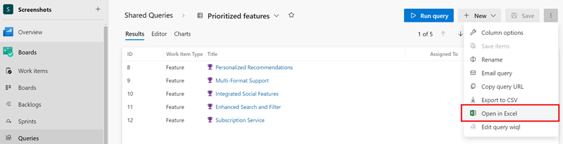
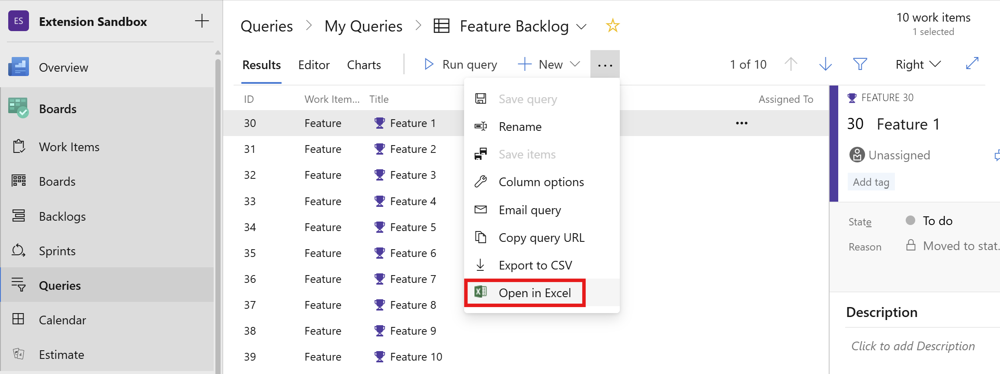
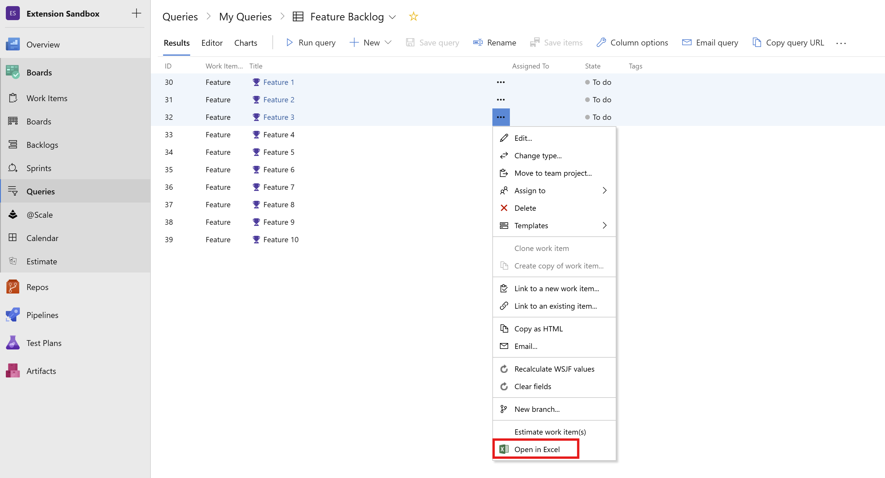

Use this extension for bulk editing work items, or to leverage Excel tools to analyze and visualize a large number of work items. Work items that are opened in Excel can be edited and published back to Azure DevOps with a single click. Once you are ready to publish your changes, simply hit "Publish" from Excel to sync your changes back to Azure DevOps. 

> **This version supports the versions of Azure DevOps/Team Foundation Server up to 2019. For more current versions, and Azure DevOps Services, the [Azure DevOps Open in Excel extension](https://marketplace.visualstudio.com/items?itemName=blueprint.vsts-open-work-items-in-excel) should be used.**

> **Note:** This extension requires Microsoft Excel, and an installed version of Visual Studio or the free Azure DevOps Office Integration client.
> Click [here](https://aka.ms/devopsexcel) to learn more.

### Open an entire query in Excel for editing, data analysis and more
To access an entire query, navigate to Work > Queries, select the query you would like to open and use the right-click option in the context menu to "Open in Excel". 

You can also click the "Open in Excel" button available on the query result toolbar as well.  

### Select multiple work items and open them in Excel
Sometimes you may want to select a specific set of work items from a query, not the entire query. To do this, select the work items you want (hold Shift to select multiple consecutive work items or Ctrl to select multiple work items) and use the Right-click on selected work items to "Open in Excel." 

> Microsoft DevLabs is an outlet for experiments from Microsoft, experiments that represent some of the latest ideas around developer tools. Solutions in this category are designed for broad usage and you are encouraged to use and provide feedback on them; however, these extensions are not supported nor are any commitments made as to their longevity.
