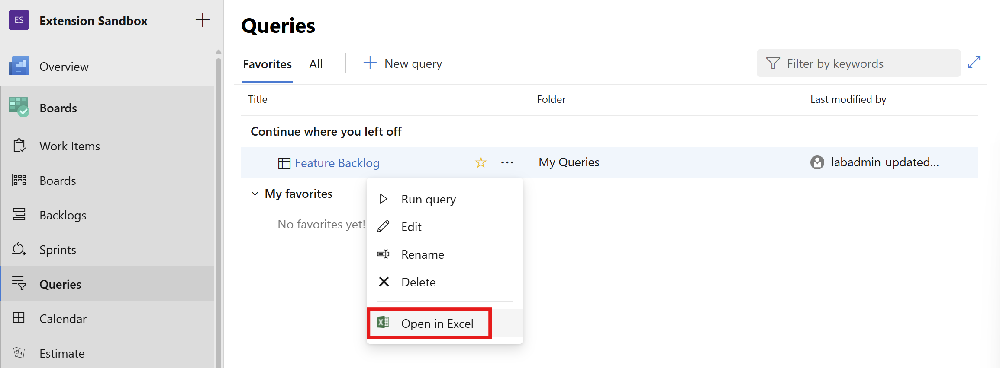

Use this extension for bulk editing work items, or to leverage Excel tools to analyze and visualize a large number of work items. Work items that are opened in Excel can be edited and published back to Azure DevOps with a single click. Once you are ready to publish your changes, simply hit "Publish" from Excel to sync your changes back to Azure DevOps. 

> **Note:** This extension requires Microsoft Excel, and an installed version of Visual Studio or the free Azure DevOps Office Integration client.
> Click [here](https://aka.ms/devopsexcel) to learn more.

# Documentation 

Supported scenarios:
* Open Work Item Query in Excel (from Query explorer or Query results toolbar)
* Open selected Work Item(s) in Excel

## Open an entire query in Excel for editing, data analysis and more
To access an entire query, navigate to Work > Queries, select the query you would like to open and use the right-click option in the context menu to "Open in Excel". 

You can also click the "Open in Excel" button available on the toolbar for a query as well.  

## Select multiple work items and open them in Excel
Sometimes you may want to select a specific set of work items from a query, not the entire query. To do this, select the work items you want (hold Shift to select multiple consecutive work items or Ctrl to select multiple work items) and use the Right-click on selected work items to "Open in Excel." 

# Support

> Microsoft DevLabs is an outlet for experiments from Microsoft, experiments that represent some of the latest ideas around developer tools. Solutions in this category are designed for broad usage and you are encouraged to use and provide feedback on them; however, these extensions are not supported nor are any commitments made as to their longevity.

## How to file issues and get help

This project uses [GitHub Issues](https://github.com/microsoft/vsts-open-in-excel/issues) to track bugs and feature requests. Please search the existing issues before filing new issues to avoid duplicates. For new issues, file your bug or feature request as a new Issue. 

## Microsoft Support Policy

Support for this project is limited to the resources listed above.
